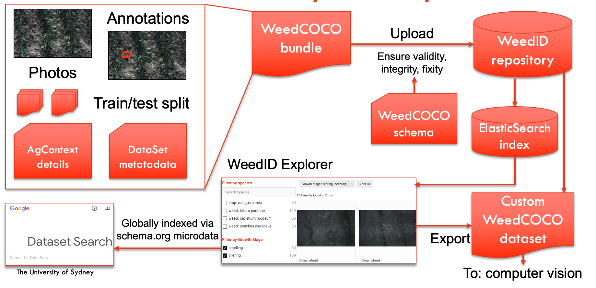

# Welcome to the Weeds Imaging Database (WeedID). 

WeedID is an open source, searchable, weeds image platform designed to facilitate the research and development of machine learning algorithms for weed recognition in cropping systems.
It brings together existing datasets, enables users to contribute their own data and pulls together custom datasets for straightforward download. 

# Background 

Large numbers of high quality, annotated weed images are essential for the development of weed recognition algorithms that are accurate and reliable in complex biological systems.
Accurate weed recognition enables the use of site-specific weed control (SSWC) in agricultural systems eliminating the need for wasteful whole field treatments.
This approach substantially reduces weed control inputs and creates opportunities for the introduction of alternative weed control technologies that were not previously feasible for use as indiscriminate whole field treatments.
SSWC relies on accurate detection (is a weed present) and identification (what is the species/further information on morphology) of weeds in agricultural and environmental systems (crop, pastures, rangelands and non-crop areas, etc.).
Camera-based weed recognition using deep learning algorithms has emerged as a frontrunner for in-crop site-specific control with an improved ability to handle variation.
Training and development of algorithms require significant quantities of high-quality, annotated image data.
WeedID is addressing this challenge by enabling the easy access and contribution of weed image data on an open source platform with search, dynamic filter and preview functions for custom dataset download capability. 

# Data supported 

Annotation data is stored in the Weed-COCO format, an extension of MS COCO for weed recognition in grain crops. Weed-COCO incorporates additional whole-dataset contextual information on: 

- Crop type 

- Crop growth stage (text and BBCH) 

- Soil colour 

- Surface coverage 

- Weather description 

- Location 

- Camera metadata (camera model, collection height, angle, lens, focal length, field of view) 

- Lighting  

The format may also be applicable to related agricultural purposes.
As with MS COCO, the format supports classification, bounding box and segmentation labels indicating the presence of a specific or unknown species of weed.
Reporting these details will help ensure consistency in published datasets for ease of comparison and use in further research and development.

# Acknowledgements 

This project has been funded by the Grains Research and Development Corporation.
The platform was developed by the Sydney Informatics Hub, a core research facility of the University of Sydney, as part of a research collaboration with the Australian Centre for Field Robotics and the Precision Weed Control Group at the University of Sydney.

# Citation Guidelines 

## General 

If you found WeedID useful in your research, please cite the database as: 

INSERT_CITATION 

## Specific Datasets 

Each set of imagery used within the database should also be cited with the correct database Digital Object Identifier (DOI) and relevant papers. 
