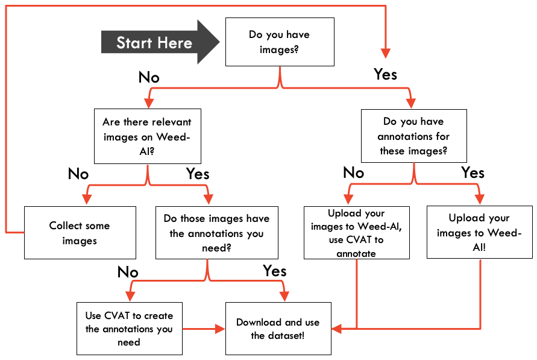

# User Guide

## Getting Started

You can contribute to Weed-AI in several different ways:
- You can upload images
- You can upload annotations
- You can create annotation tasks
- You can annotate existing datasets

To make things simpler, we've created a guide to show you can do each of these.

## Weed-AI Flowchart

